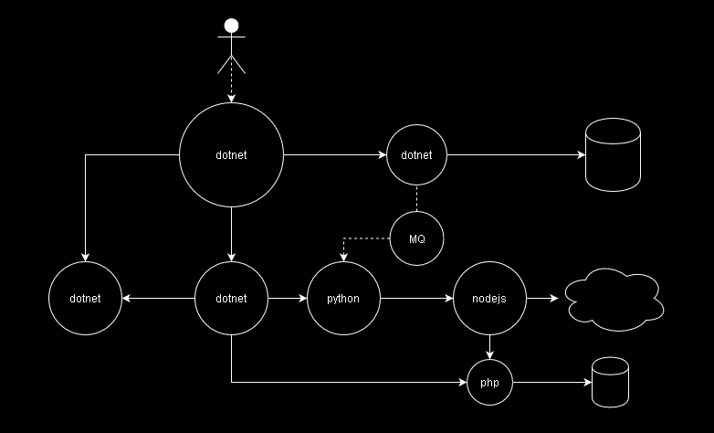
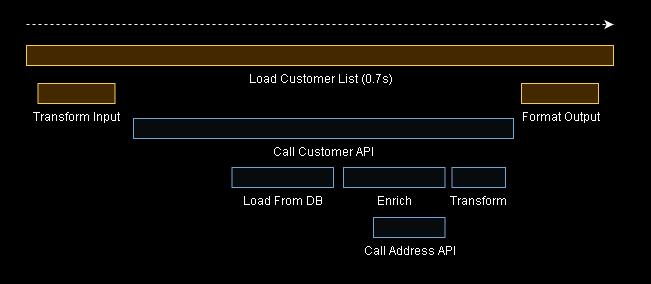
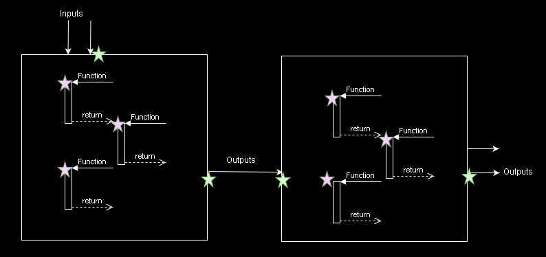

# Observability of Distributed .NET Applications

Erik Svensson, Webstep, 2020

---
<!-- backgroundImage: url('./images/background_2.jpg') -->

# The Three Pillars of Observability

_Increasingly important as we move to distributed_

- __Tracing__ - Follow the request flow within the system
- __Metrics__ - Measure, count, gauge and predic the system
- __Logging__ - Application specific messages with key info

---

<!-- backgroundImage: url('./images/background_2.jpg') -->

# The State of Observability Tooling

_A lot has happened in 2020_

- __Microservices is Norm / Debugging methods outdated__ 
- __Vendored Solutions / Lacking Conventions__
- __OpenTracing + OpenCensus = OpenTelemetry__
- __Observability as a First Class Citizen__

---

<!-- backgroundImage: url('./images/background_2.jpg') -->

# OpenTelemetry Overview

```text

    +---------+   host | 
    | Service |        |
    |  + SDK  |        |
    +----+----+        |
         |             |
         v             |
   +-----+-----+       |       +------------------+       +------------+
   | Collector +-------+------>+ Exporter Backend +<------+ Monitoring |
   +-----------+       |       +------------------+       +------------+

```
---

<!-- backgroundImage: url('./images/background_1.jpg') -->

# OpenTelemetry and .NET

_Getting there but not quite..._

- __Tracing__: 🙂
- __Metrics__: 😐
- __Logging__: 🙁

---
<!-- backgroundImage: url('./images/background_1.jpg') -->

# Today's Excercise

_Add Observability to a Microservice System_

- __Small effort that will bring lots of value__
- __Simulate production environment with Docker__
- __Visualize in Grafana__

---
<!-- backgroundImage: url('./images/background_3.jpg') -->

# Step 1: Tracing

_Lets figure out how our services interact by adding tracing_

---
# Why is Tracing Helpful?



---
# Trace Spans



---
# Where to Begin?



_Now lets look at some code!_

---
<!-- backgroundImage: url('./images/background_4.jpg') -->
# Step 2: Metrics

_Lets measure our services_

---
# What are Meters?

- __Counters__: How many requests are made to a service?
- __Values__: _Gauges_ - What is the current memory usage?
- __Sums__: How many seconds does a process take?
- __Measures__: _Histograms_ Combination of Sum, Count and Quantiles.

_Now lets look at some code!_

---

<!-- backgroundImage: url('./images/background_5.jpg') -->
# Step 3: Logging
_Lets export our logs to a log aggregator_

---
# Log Aggregation

- __Agents__: Promtail, Fluentd, Logstash ...
- __Engines__: Loki, Elasticsearch, Splunk ...
- __Visualization__: Grafana, Kibana, Azure Insights ...

_Now lets look at some code!_
